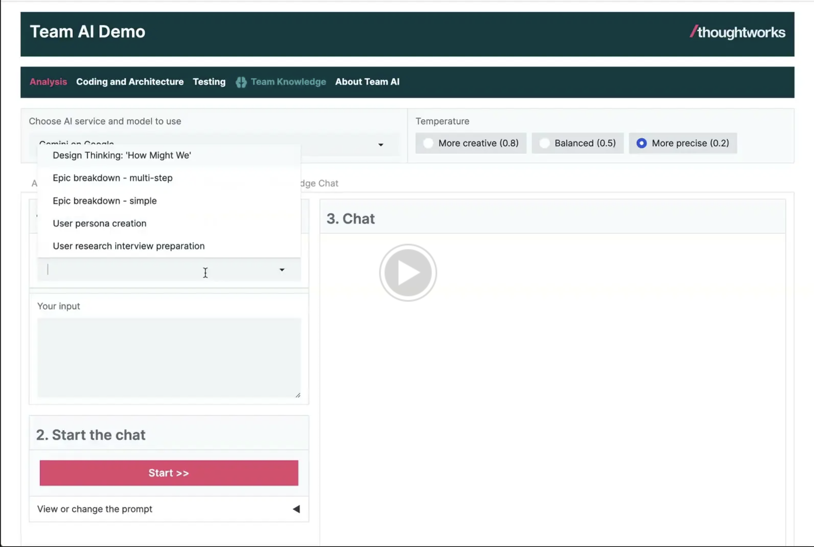

# Haiven team assistant

(formerly known as "Team AI")

The Haiven team assistant is an accelerator we use to pilot the use of Generative AI assistance for software delivery tasks beyond coding.

This codebase provides the scaffolding to build a one-container web application that can act as an assistant to a software delivery team. You can plug in your own "knowledge pack", adapted to your organisation's and teams' needs.


It lets you codify your practices and knowledge and make it available to an AI assistant, to surface it to team members just-in-time when they are working on a task.


[](https://drive.google.com/file/d/16Acc_eDC6iphHk9wQLrNsl8rksP_wjXz/view?usp=sharing)

## Quickest way to try it out

Prerequisite:
- Log into the GitHub Container Registry: `echo $CR_PAT | docker login ghcr.io -u USERNAME --password-stdin` ([documentation about how to get a token and authorize yourself here](https://docs.github.com/en/packages/working-with-a-github-packages-registry/working-with-the-container-registry#authenticating-with-a-personal-access-token-classic))

### With Azure OpenAI

- Create a `.env` file with the content of (app/.env.azure.template)[app/.env.azure.template]
- Change the `AZURE_OPENAI_API_KEY` in that file to the API Key - ask the Haiven team for access to the "trial" Azure OpenAI API Key, if you haven't received it yet.

```
mkdir haiven
cd haiven
# Put the .env file into this new folder
git clone git@github.com:tw-haiven/haiven-tw-knowledge-pack.git
docker run \
        -v ./haiven-tw-knowledge-pack:/app/teams \
        --env-file .env \
        -e AUTH_SWITCHED_OFF=true \
        -e TEAM_CONTENT_PATH=/app/teams \
        -p 8080:8080 \
        ghcr.io/tw-haiven/haiven:main
```

### With Ollama, locally

Prerequisites:
- Install [Ollama](https://ollama.com/).

```
ollama pull llama2
ollama pull llava:7b
mkdir haiven
cd haiven
git clone git@github.com:tw-haiven/haiven-tw-knowledge-pack.git
# As long as the repo is private, you'll need to log in (see doc link above)
echo $CR_PAT | docker login ghcr.io -u USERNAME --password-stdin
docker run \
        -v ./haiven-tw-knowledge-pack:/app/teams \
        -e AUTH_SWITCHED_OFF=true \
        -e TEAM_CONTENT_PATH=/app/teams \
        -e DOMAIN_NAME=team_demo \
        -e ENABLED_PROVIDERS=ollama \
        -e ENABLED_EMBEDDINGS_MODEL=ollama \
        -e ENABLED_VISION_MODEL=llava:7b \
        -e OLLAMA_BASE_URL=http://host.docker.internal:11434 \
        -p 8080:8080 \
        ghcr.io/tw-haiven/haiven:main
```

Please note that while this local mode is great for getting a taste of the application, the prompts in our knowledge pack are currently only tested with the AWS, Azure and Google models listed [here](https://github.com/tw-haiven/haiven/blob/main/app/config.yaml), and might not work as well with the open models loaded with Ollama.

## Why?

The product and tooling space around coding assistance is relatively mature, in the sense that it is possible to see value already today, and some of the products are already adopted in large enterprises.

However, when it comes to software delivery tasks other than coding, there is not much out there yet. Some of the incumbent vendors for the delivery toolchain (wikis, issue trackers, CI/CD products, ...) are working on adding AI to their toolchain, and their is the odd startup here or there that tries to tackle one of the task areas. There are also a bunch of products evolving that enable the sharing and monitoring of prompts in an organisation, which could be used to build a similar sandbox. But overall, it is hard to gather experience and data today about how AI can be used to assist a software delivery team in their day-to-day work.

**Haiven** provides a lean self-cloud-hosted sandbox to experiment, and to gather data and experience today that can inform strategy and tool choices for the future.

* Control the setup by deploying into your own infrastructure environment, instead of trusting a bleeding edge startup
* Use the models provided by your cloud provider of choice (AWS, Google Cloud, or Azure), instead of running a risk assessment for and creating contracts with a new vendor
* Add your own SSO for access control

## Limited-by-design

For now, this is a one-container web application. Everything is baked into the container image you build, and everything happens in memory. The only persistence are the logs written by the application. This is by design, to keep the infrastructure setup as simple as possible, and reduce the barrier to experimentation.

But of course, it comes with limitations:

- No database means you have to rebuild the image and redeploy the application every time you change the knowledge pack
- Users cannot edit and persist anything at runtime in the application
- User chat sessions are not persisted
- Limits to scalability, and to size of the knowledge packs, as everything needs to fit into memory
- Very simple in-memory RAG (Retrieval-Augmented Generation) implementation, just enough to get an idea of the potential in the day-to-day work

## HOW TO USE

### 1. Prepare access to Large Language Models

There are 4 options:
- Ollama (locally)
- Azure AI Studio
- AWS Bedrock
- Google AI Studio

#### Option 1: Use Ollama locally on your machine

- Install [Ollama](https://ollama.com/) on your machine, as described by their website
- Pull one of the models defined in the [config.yaml](app/config.yaml) file, e.g. `ollama pull llama2`
- Create an `.env` file: `cp app/.env.ollama.template app/.env`

#### Option 2: Setup credentials for Azure, GCP or AWS

- Prepare the model setup and credentials in your respective Cloud environment. Check `[app/config.yaml](app/config.yaml)` for the models that are currently configured out of the box, or read below about how to configure additional models.
- Consider setting quota and billing alerts to avoid unexpected costs and detect unexpected usage.
- Create .env file from the respective template: Pick the template file that represents the provider you want to use, e.g. `cp ./app/.env.azure.template ./app/.env`.
- Look at the defined environment variables in your new `.env` file and set the corresponding credentials.

### 2. Get (and adapt) a "knowledge pack"

You can clone the [Community Knowledge Pack](https://github.com/tw-haiven/haiven-community-knowledge-pack) or the [Thoughtworks Knowledge Pack](https://github.com/tw-haiven/haiven-tw-knowledge-pack) to get started.

[Find more documentation about knowledge packs here](docs/knowledge_packs.md).


### 3. Run locally
#### Option 1: Run the base image locally

See "quickest way to try it out" above, which describes how to run the base Docker image with Ollama as the model provider.

If you want to use Azure, GCP or AWS, you need to set the corresponding environment variables as documented in the `.env.***.template` files, and feed those to the container.

#### Option 2: Run the code locally

Prerequisites:
- Python3
- [Poetry](https://python-poetry.org/)
- If you don't have OAuth integration and credentials set up, you can set `AUTH_SWITCHED_OFF=true` in the `.env` file.

Run:

```
poetry run init
poetry run app
```

Test:
```
poetry run test
```

### 4. Deploy your own instance

#### Set up OAuth integration

If you want to integrate your own OAuth provider, check out the OAuth-related environment variables as described in the `.env.***.template` files.

#### Build an image with your knowledge pack

Look at the [Community Knowledge Pack repository](https://github.com/tw-haiven/haiven-community-knowledge-pack) for an example of a `Dockerfile` that helps you bake your own knowledge pack into a Haiven image that you can then deploy to your own environment. When you do the deployment, remember to set the environment variables and secrets described in the `.env` template files in that runtime.

### Configure more models
#### Setup models

[`app/config.yaml`](app/config.yaml) is where the configuration for the models and embeddings is set. You can add or remove models from the configuration file. It is pre-populated with some working examples. Note that if you want to add a new type of embeddings, the code would also have to change to support that.

Secrets should not be added to `app/config.yaml`. For that matter in `app/config.yaml`, if one of the values is considered a secret, you must use a placeholder for an environment variable using the following format: `${ENV_VAR_NAME}`, where `ENV_VAR_NAME` is the name of the environment variable. This value will be replaced on runtime with the value of the environment variable, which can be securely set at deployment time.

> Note: Embeddings model cannot be changed after app initialization. The same embeddings model is used independentely of the LLM model selected.

##### Setup default models

You can fix the models to be used by different use cases by setting the `chat`, `vision` and `embeddings` properties to a valid model `id` value, in the `default_models` section of the `app/config.yaml` file.

Example:

```yaml
default_models:
  chat: azure-gpt4
  vision: google-gemini
  embeddings: text-embedding-ada-002
```

Only embeddings is mandatory. When chat or vision are not set, the app will show a dropdown allowing the user to select the model to use.

#### Deploy

How you deploy the container image is all up to your environment - you could use Google Cloud Run, or an existing Kubernetes cluster on AWS, or an equivalent service on Azure, or your own data center container infrastructure.

This makes you responsible for the usual application security practices like secrets management, TLS, security monitoring and alerting, etc.

### 5. Add custom interaction modes

Because the application uses Gradio, a frontend framework that is meant for quick UI prototyping with machine learning models, it is quite easy to add additional tabs and UI elements to the application. Beyond the interaction modes available, you can think about what other more custom interactions would be helpful to your delivery team.

The code shows one common example: Querying a database with natural language. You can adapt that to be connected to your own database, e.g. a database in a test environment, to be used by testers, new team members who are not familiar with the schema yet, or even business stakeholders.
