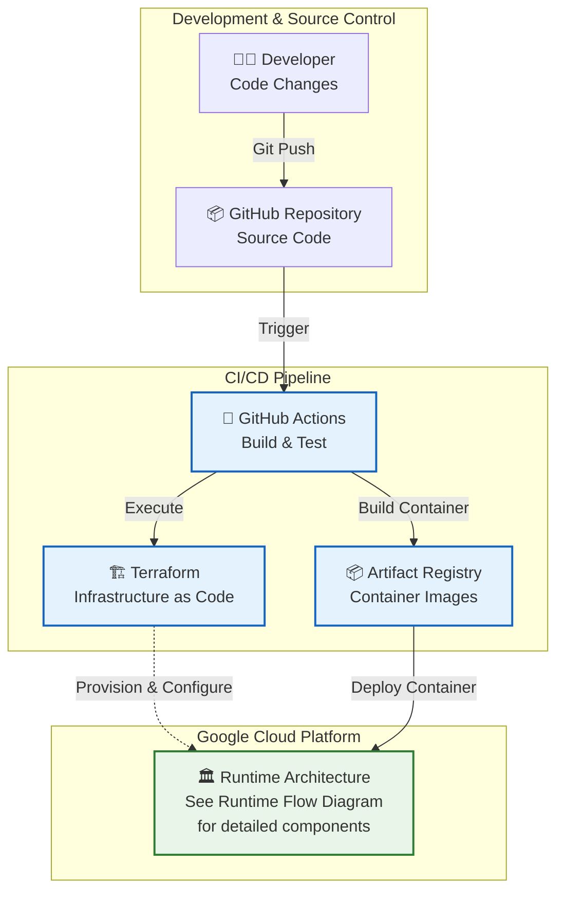
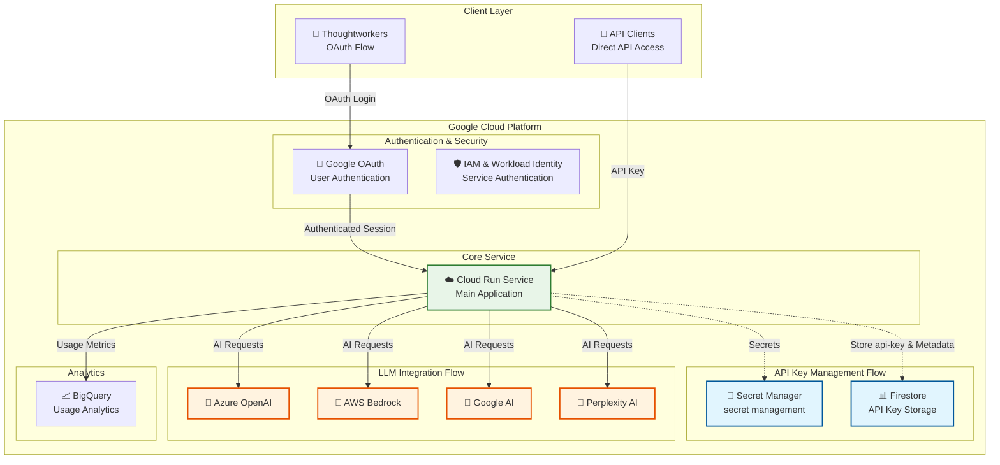
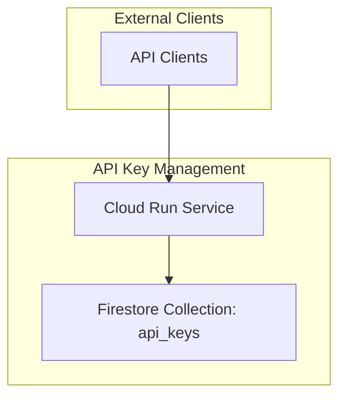

# Haiven Architecture

## Overview

Haiven is a cloud-native AI application deployed on Google Cloud Platform (GCP) using Cloud Run. The application provides AI-powered features including chat, knowledge management, and API key management for Thoughtworkers.

## Current Deployment Architecture
### Deployment Architecture Diagram


```mermaid
graph TB
    subgraph "Development & Source Control"
        DEV[👨‍💻 Developer<br/>Code Changes]
        GH_REPO[📦 GitHub Repository<br/>Source Code]
    end
    
    subgraph "CI/CD Pipeline"
        direction TB
        GH[🔄 GitHub Actions<br/>Build & Test]
        AR[📦 Artifact Registry<br/>Container Images]
        TF[🏗️ Terraform<br/>Infrastructure as Code]
    end
    
    subgraph "Google Cloud Platform"
        RUNTIME[🏛️ Runtime Architecture<br/>See Runtime Flow Diagram<br/>for detailed components]
    end
    
    %% Development Flow
    DEV -->|Git Push| GH_REPO
    GH_REPO -->|Trigger| GH
    
    %% Build & Deploy Flow
    GH -->|Build Container| AR
    GH -->|Execute| TF
    
    %% Infrastructure Deployment
    TF -.->|Provision & Configure| RUNTIME
    
    %% Runtime Dependencies
    AR -->|Deploy Container| RUNTIME
    
    %% Styling
    classDef cicd fill:#e3f2fd,stroke:#1565c0,stroke-width:2px
    classDef runtime fill:#e8f5e8,stroke:#2e7d32,stroke-width:2px
    
    class GH,AR,TF cicd
    class RUNTIME runtime
```

### Runtime Architecture Diagram


```mermaid
graph TB
    subgraph "Client Layer"
        TW[👥 Thoughtworkers<br/>OAuth Flow]
        API[🔌 API Clients<br/>Direct API Access]
    end
    
    subgraph "Google Cloud Platform"
        subgraph "Authentication & Security"
            OAUTH[🔐 Google OAuth<br/>User Authentication]
            IAM[🛡️ IAM & Workload Identity<br/>Service Authentication]
        end
        
        subgraph "Core Service"
            CR[☁️ Cloud Run Service<br/>Main Application]
        end
        
        subgraph "API Key Management Flow" 
            direction TB
            SM[🔑 Secret Manager<br/>secret management]
            FS[📊 Firestore<br/>API Key Storage]
            style SM fill:#e1f5fe
            style FS fill:#e1f5fe
        end
        
        subgraph "LLM Integration Flow"
            direction TB
            AZURE[🤖 Azure OpenAI]
            AWS[🤖 AWS Bedrock] 
            GOOGLE[🤖 Google AI]
            PERPLEXITY[🤖 Perplexity AI]
            style AZURE fill:#fff3e0
            style AWS fill:#fff3e0
            style GOOGLE fill:#fff3e0
            style PERPLEXITY fill:#fff3e0
        end
        
        subgraph "Analytics"
            BQ[📈 BigQuery<br/>Usage Analytics]
        end
    end
    
    %% Authentication Flows
    TW -->|OAuth Login| OAUTH
    OAUTH -->|Authenticated Session| CR
    API -->|API Key| CR
    
    %% API Key Management (No LLM Interaction)
    CR -.->|Secrets| SM
    CR -.->|Store api-key & Metadata| FS
    
    %% LLM Integration Flow (Separate)
    CR -->|AI Requests| AZURE
    CR -->|AI Requests| AWS
    CR -->|AI Requests| GOOGLE
    CR -->|AI Requests| PERPLEXITY
    
    %% Analytics
    CR -->|Usage Metrics| BQ
    
    %% Styling
    classDef apiKeyFlow fill:#e1f5fe,stroke:#01579b,stroke-width:2px
    classDef llmFlow fill:#fff3e0,stroke:#e65100,stroke-width:2px
    classDef core fill:#e8f5e8,stroke:#2e7d32,stroke-width:2px
    
    class SM,FS apiKeyFlow
    class AZURE,AWS,GOOGLE,PERPLEXITY llmFlow
    class CR core
```

## Current Deployment Components

### 1. **Cloud Run Service**
- **Location**: `us-central1`
- **Scaling**: 1-3 instances, auto-scaling based on demand
- **Resources**: 1 CPU, 2GB memory per instance
- **Concurrency**: Up to 400 requests per instance
- **Timeout**: 300 seconds
- **Session Affinity**: Enabled for consistent user experience

### 2. **Security & Identity**
- **Google OAuth**: Authentication for Thoughtworkers
- **Workload Identity**: GitHub Actions integration for secure deployments
- **Secret Manager**: Stores sensitive API keys and configuration
- **Service Account**: enabled with minimal required permissions

### 3. **External AI Services**
- **Azure OpenAI**: GPT-3.5, GPT-4, embeddings
- **AWS Bedrock**: Claude models for vision
- **Google AI**: Gemini models
- **Perplexity AI**: Additional AI capabilities

### 4. **CI/CD Pipeline**
- **GitHub Actions**: Automated deployment
- **Terraform**: Infrastructure as Code
- **Artifact Registry**: Docker image storage
- **OIDC**: Secure authentication without long-lived credentials

## Proposed Changes: Firestore Integration

### Current API Key Storage
- **Location**: Local JSON file in Cloud Run container
- **Limitations**: Not scalable, no concurrent safety, not cloud-native

### New API Key Storage with Firestore


```mermaid
graph TB
    subgraph "API Key Management"
        CR[Cloud Run Service]
        FS[Firestore Collection: api_keys]
    end

    subgraph "External Clients"
        CLIENTS[API Clients]
    end

    CLIENTS --> CR
    CR --> FS
```

### Firestore Schema Design

**Option 1: Composite Index Approach (Recommended)**
```json
{
  "collection": "api_keys",
  "document_id": "key_hash",
  "fields": {
    "name": "string",
    "user_id": "string (pseudonymized)",
    "created_at": "timestamp",
    "expires_at": "timestamp", 
    "last_used": "timestamp",
    "usage_count": "integer"
  },
  "composite_index": [
    {
      "collectionGroup": "api_keys",
      "queryScope": "COLLECTION",
      "fields": [
        {"fieldPath": "user_id", "order": "ASCENDING"},
        {"fieldPath": "created_at", "order": "DESCENDING"}
      ]
    }
  ]
}
```

**Option 2: Subcollection Approach**
```json
{
  "collection": "users",
  "document_id": "pseudonymized_user_id",
  "subcollection": "api_keys",
  "document_id": "key_hash",
  "fields": {
    "name": "string",
    "created_at": "timestamp",
    "expires_at": "timestamp", 
    "last_used": "timestamp",
    "usage_count": "integer"
  }
}
```

**Recommendation: Option 1 (Composite Index)**
- **Pros**: 
  - Simpler data model
  - Single collection to manage
  - Easier to implement and migrate
  - Better for global queries (admin functions)
- **Cons**: 
  - Requires composite index for efficient user queries
  - Slightly more complex queries

**Query Examples:**

```javascript
// List keys for a user (Option 1)
const userKeys = await firestore
  .collection('api_keys')
  .where('user_id', '==', pseudonymizedUserId)
  .orderBy('created_at', 'desc')
  .get();

// List keys for a user (Option 2)
const userKeys = await firestore
  .collection('users')
  .doc(pseudonymizedUserId)
  .collection('api_keys')
  .orderBy('created_at', 'desc')
  .get();

// Find specific key (both options)
const keyDoc = await firestore
  .collection('api_keys')
  .doc(keyHash)
  .get();
```

**Performance Characteristics:**
- **Option 1**: O(log n) for user queries with index, O(1) for key lookup
- **Option 2**: O(log n) for user queries, O(1) for key lookup, but requires knowing user_id first _which is not possible_.

### Security Rules (Firestore)
Allow access to gcloud run `service account`

## Architecture Benefits

### 1. **Scalability**
- Cloud Run auto-scales based on demand
- Firestore handles concurrent API key operations
- No single point of failure

### 2. **Security**
- OAuth authentication for users
- Workload Identity for CI/CD
- Secret Manager for sensitive data
- Firestore security rules for API key access

### 3. **Operational Excellence**
- Infrastructure as Code with Terraform
- Automated deployments via GitHub Actions
- Monitoring and logging built-in
- Easy rollback capabilities

### 4. **Cost Optimization**
- Pay-per-use Cloud Run scaling
- Firestore free tier for development
- Efficient resource utilization

## Deployment Process

### 1. **Bootstrap (One-time)**
```bash
# Create GCP project infrastructure
./bootstrap.sh
```

### 2. **Continuous Deployment**
```bash
# Automated via GitHub Actions
# Builds Docker image
# Deploys to Cloud Run
# Updates infrastructure via Terraform
```

### 3. **Manual Steps**
- Create secrets in Secret Manager
- Configure Google OAuth
- Set up custom domain (optional)

## Monitoring & Observability

### 1. **Cloud Run Metrics**
- Request count and latency
- Error rates and status codes
- Resource utilization (CPU, memory)

### 2. **Firestore Metrics**
- Read/write operations
- Storage usage
- Query performance

### 3. **Application Logs**
- Structured logging via Cloud Logging
- Error tracking and alerting
- User activity monitoring

## Future Enhancements

### 1. **Multi-Region Deployment**
- Global load balancing
- Regional Firestore instances
- Disaster recovery capabilities

### 2. **Advanced Analytics**
- BigQuery integration for usage analytics
- Custom dashboards and reporting
- A/B testing capabilities

### 3. **Enhanced Security**
- VPC connector for private networking
- Cloud Armor for DDoS protection
- Advanced IAM policies

---

*This architecture document reflects the current deployment and proposed changes as of July 2025.* 