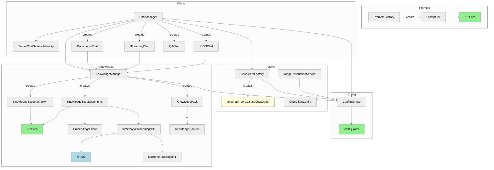
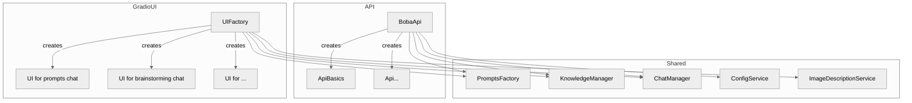

# Codebase overview

This is a high level overview of how the (Python) code is structured, as of the time of committing this. It's not fully complete, but shows the components that are most important to understand the structure. 

First, an overview of the main shared components

* "KP Files" stands for "Knowledge Pack Files", i.e. that component is loading files from the knowledge pack
* All of these are getting wired together in [`App`](../app/app.py).

We currently have two consumers of those main components, the Gradio UI, and the API used by the "Guided mode" React frontend:

