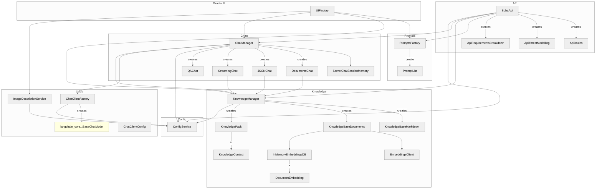

# Codebase overview

This is a high level overview of how the (Python) code is structured, as of the time of committing this. It's not fully complete, but shows the components that are most important to understand the structure.

