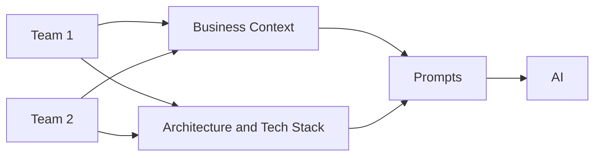
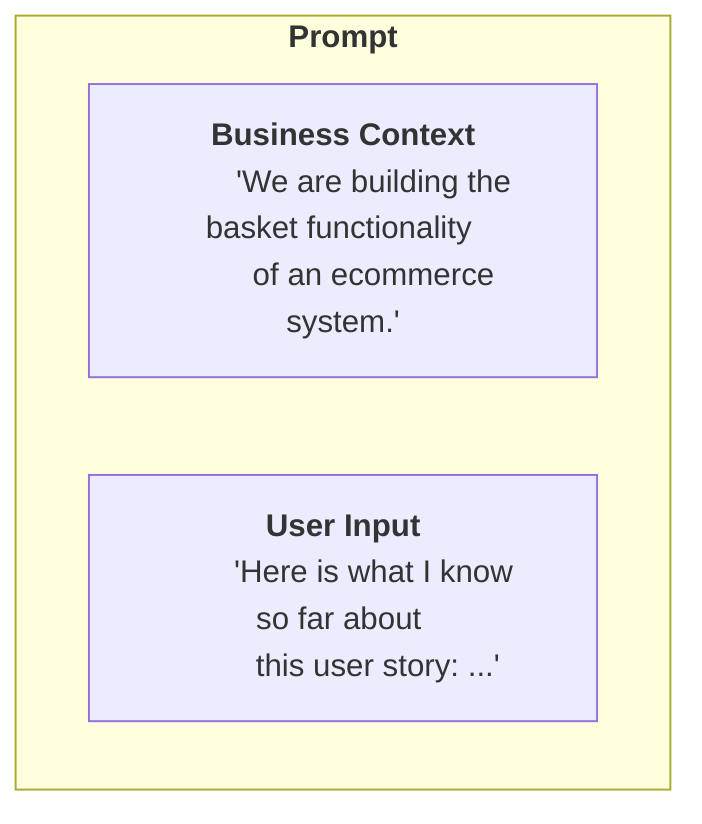

# Creating a Haiven knowledge pack

## Concept
The "secret sauce" to make Haiven work and be useful for your particular team lies in the prompts, and in the knowledge sources. They stay valuable for you regardless of what tool you plug them into.

### What happens when you execute a prompt

Every new chat session in a "plain" AI chatbot application is a new start - the AI doesn't remember that you're working on a software delivery team, what your domain is, your architecture, none of that. You don't want to repeat that every time you interact with the AI. Haiven therefore helps you set the context again and again with reusable context descriptions. This also makes prompts reusable across multiple teams and domains, by switching out those context descriptions.

The most common difference between teams or domains lies in their domain context, and their architecture and tech stack. Those are therefore the context descriptions that are used by most prompts. They reference those pieces of knowledge via the `{domain}` and `{architecture}` variables, depending on which domain is activated.



**Example**

Here is a simplified example of a prompt:
```
I am a team member in a software delivery team. Some context about the application we are building:

-----
CONTEXT DESCRIPTION:
{domain}
-----

... [ additional {user_input} etc, left out to keep the example short ] ...

With the context and my input, help me break this user flow down into user stories that can be implemented step by step by a delivery team.

```

With this approach, you can provide high level context to each prompt with a static, reusable text snippet, but then let the user provide the specific input for the task at hand in the UI.




## How to set up your "knowledge pack"

### Folder structure
Each team's knowledge pack needs to have the following folder structure:

```
+ knowledge-pack
    + prompts
        + chat
            - prompt_1.md
            - prompt_2.md
            - prompt_3.md
    + contexts
        + team_1
            + embeddings
                - pdf_1.kb
                    - index.faiss
                    - index.pkl
                - pdf_1.md
                - document_1.kb
                    - index.faiss
                    - index.pkl
                - document_1.md
            - domain.md
            - architecture.md
            - another_knowledge_snippet.md
        + context_2
            + embeddings
                ...
            domain.md
            architecture.md
            ...
            
```

### 1. Add and change contexts

The minimum of knowledge you should set up for prompts to work are the static context snippets for `domain.md` and `architecture.md`. These should describe the team's domain context and the team's architecture at a high level, in 2, maybe max 3 paragraphs.

These snippets will be included in every prompt that references them, so they will be a part of the prompt size every time! Therefore you should think about how to concisely describe the business context and architecture, and use the important key words to give the AI good pointers about what you're working on.

You can try and sanity check if the AI "understands" your knowledge by going into a chat conversation (e.g. by using the `/chat` route):

- Paste your knowledge snippet and ask the AI to summarize and elaborate on it in its own words. See if it makes sense. Adjust the snippet accordingly, e.g. add domain terminology explanations, or clarify the role of an architecture component.

- Ask the AI for a simple task in the context of your snippet (e.g. to write a user story or create a domain model with your business context, or to help you with a technical decision with your architecture snippet). See if it makes sense, adjust the snippet accordingly.

### 2. Add your own prompts

Create a markdown file and put it into the `prompts/chat` folder. Use one of the existing prompt files in that folder as an example to define the metadata. The new prompt will automatically be loaded into the sidebar menu and the dashboard.

**Prompt metadata**

Every prompt file has a frontmatter block that defines metadata about the prompt:

- `identifier`: A-unique-identifier (will not be visible to the users, but it helps to be human readable, for logging and debugging purposes)
- `title`: "Title of the prompt that will show up in the UI dropdowns"
- `system`: "System prompt" (optional)
- `categories`: `["category1", "category2"]` // provide a list of task categories where this prompt should show up. Valid values: "analysis", "coding", "testing", "architecture"
- `help_prompt_description`: "Describe to the user what the prompt does"
- `help_user_input`: "Describe for the user what type of input they need to give in order to get the best results from the prompt"
- `help_sample_input`: "Provide an example of what the user input could look like"

**Prompt content**

Inside of the prompt text, you can reference the static knowledge snippets that are defined in a team's `knowledge` folder. Use the `{domain}` and `{architecture}` variables to reference the business context and architecture snippets. Those two are the default knowledge snippets that are used in many of the prepared prompts. But you can add your own if you need to. E.g., you could add an additional snippet for "Frontend coding patterns". You can define the name of the reference variable in the metadata of the knowledge snippet file (see `domain.md` as an example)

### 3. Add documents

The previous section only touched on one form of knowledge source, the context description text snippets.

The application also supports retrieval-augmented generation with a more advanced form of knowledge sources. Those can be used in 2 ways:
- Users can ask them questions directly on the **Chat with Haiven** section
- Users can use them to enhance their conversations - e.g., while they are using a prompt to prepare threat modelling, they could ask for additional relevant context from security or compliance documents.

#### Creating a knowledge source

You will find a utility CLI in the `[./cli](cli)` folder with more documentation.

The new documents will be accessible to the user in the "Documents" dropdowns in the application.
